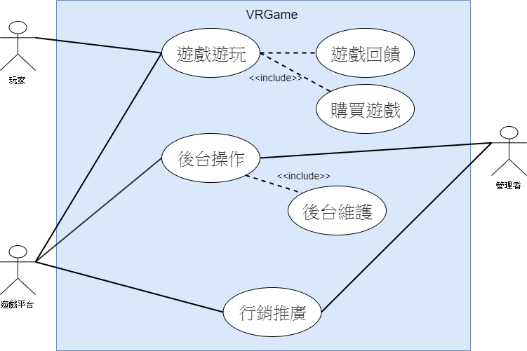
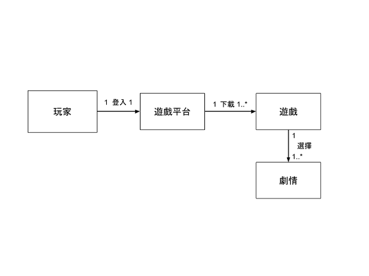
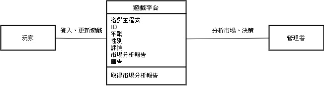
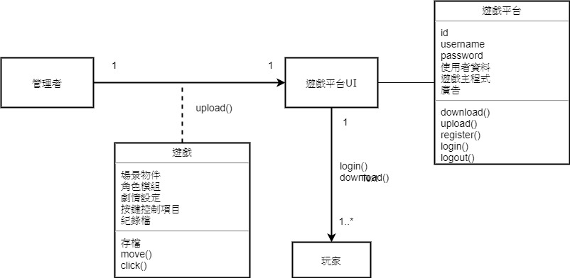
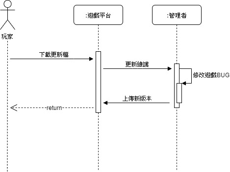
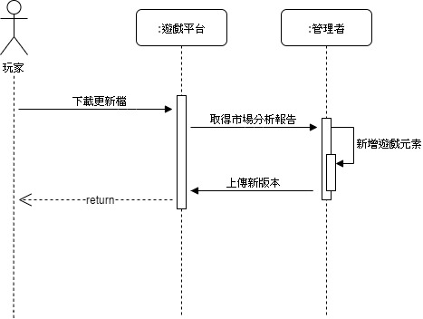

# 小組成員：
## 0624036　陳雋和
## 0624050　李鎮祐
## 0624068　吳學智
## 0424070　潘俊仁

# 1. 專題題目：
## VRGame-校園劇情對話

# 2. 文字敘述專題需求：
* #### 劇情要豐富趣味、有深度，可透過美術及音樂使玩家在視覺跟聽覺更能進入遊戲劇情。
* #### 遊戲流程要流暢，可加入懸疑元素，但是不能造成重大矛盾。
* #### 遊戲介面簡易，操作簡單且容易理解，各年齡層玩家都可遊玩。

# 3. 寫出專題之功能性需求與非功能性需求
 ## 功能性需求：
 * #### 可以發布至平台。
 * #### 玩家可以下載。
 * #### 遊戲銷售得出去。(發大財)
 * #### 玩家可以自由評論查詢資訊。
 
 ## 非功能性需求：
 * #### 輕量化：遊戲優化，效能更好，玩家可在20分鐘內將遊戲下載完。
 * #### 大眾化：玩家不需有昂貴設備亦可遊玩。
 * #### 美化　：提升遊戲質感，讓玩家留下好口碑。

# 4. 畫出 使用案例圖 (use case diagram)

# 5. 由上而下 排出 使用案例的重要性
 * #### 遊戲遊玩
 * #### 後台操作
 * #### 市場分析
# 6. 寫出 其中的 至少三個使用案例
* ###    遊戲遊玩
> #### 1. Player 在Steam 平台看到本遊戲。
> #### 2. Player 從Steam 平台下載遊戲。
> #### 3. 遊戲中選擇不同劇情。
* ###    後台維護
> #### 1. Company 進行維護檢測。
> #### 2. Steam 平台更新資訊。
> #### 3. Player 更新遊戲。
* ###    市場分析
> #### 1. Steam 平台 統計Player 年齡、性別、評論、遊戲偏好等等。
> #### 2. Steam 平台 製作市場分析報告。
> #### 3. Company 取得市場分析報告，並評估。
> #### 4. Company 依玩家喜好新增遊戲劇情。
# 7. 寫出 user story 
 * #### 身為　{玩家}　　，我希望　{遊戲可以購買}　　，藉此能{獲得遊戲體驗}。
 * #### 身為　{玩家}　　，我希望　{有回饋獎勵}　　　　　，藉此能{獲得遊戲成就}。
 * #### 身為　{遊戲平台}，我希望　{遊戲可以讓玩家遊玩}　，藉此能{獲得收益}。
 * #### 身為　{遊戲平台}，我希望　{遊戲符合市場分析結果}，藉此能{讓玩家投入更多心力}。
 * #### 身為　{遊戲平台}，我希望　{遊戲有後台維護流程}　，藉此能{盡速解決BUG}。
 * #### 身為　{管理者}　，我希望　{遊戲符合市場分析結果}，藉此能{滿足當前玩家}。
 * #### 身為　{管理者}　，我希望　{遊戲有後台維護流程}　，藉此能{改善遊戲品質，獲得好評}。
# 8. 初步類別圖(如下圖) 
## a.遊戲遊玩

## b.後台維護

## c.市場分析

# 8.1 類別圖

# 9. 系統循序圖(如下圖)
## a.遊戲遊玩

## b.後台維護

## c.市場分析

# 10. 強韌圖

