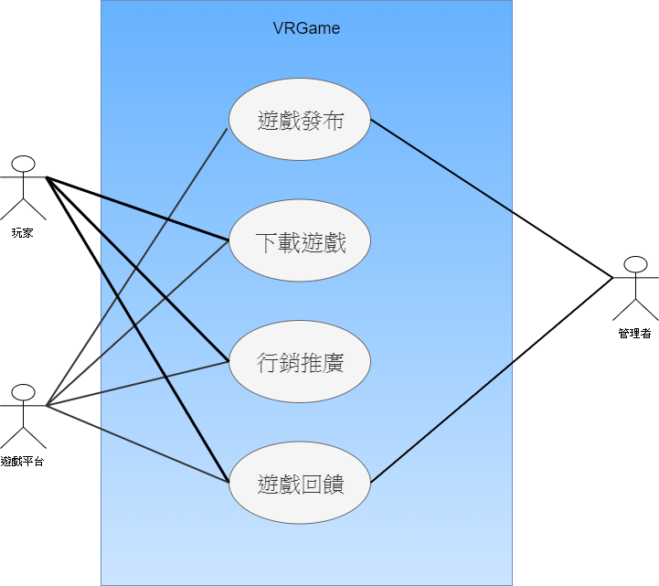
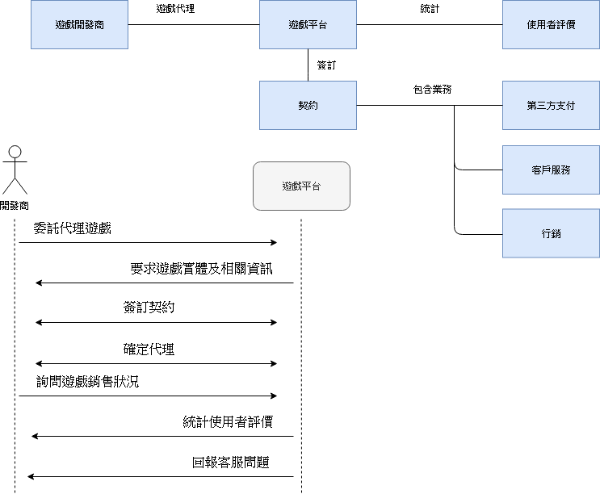
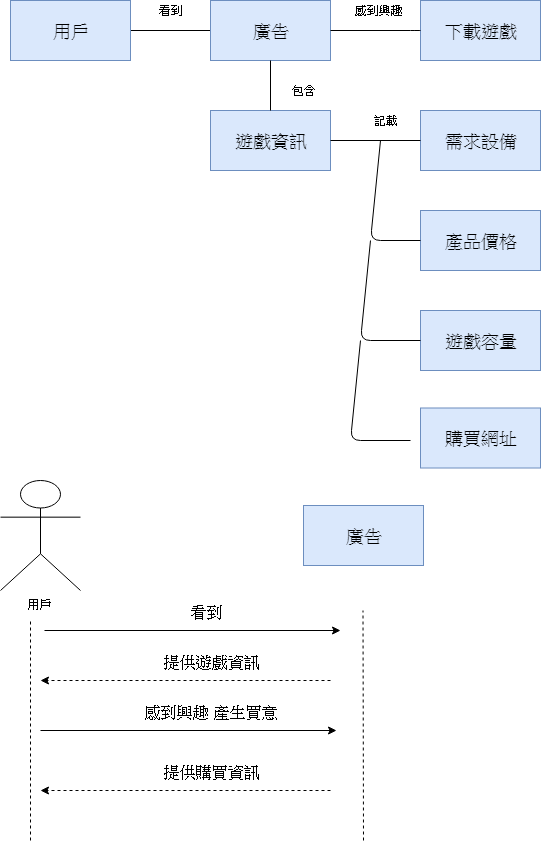
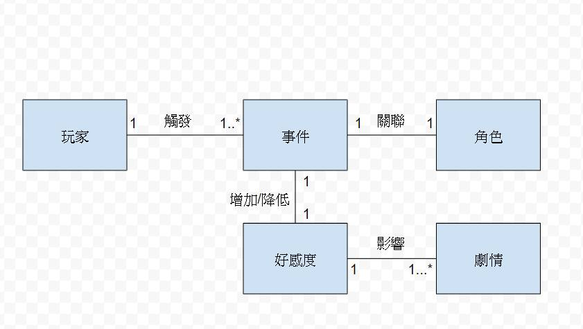
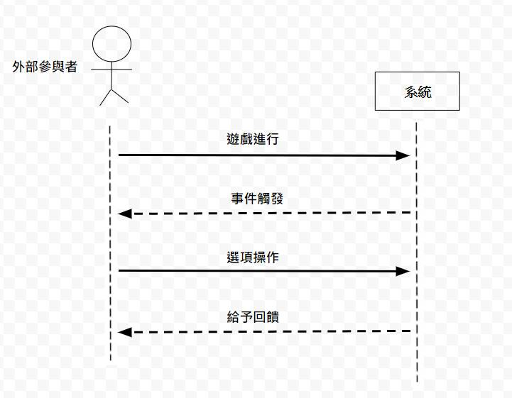

# 1. 專題題目：
## VRGame-校園劇情對話

# 2. 文字敘述專題需求：
* ## 劇情要豐富趣味、有深度，可透過美術及音樂使玩家在視覺跟聽覺更能進入遊戲劇情。
* ## 遊戲流程要流暢，可加入懸疑元素，但是不能造成重大矛盾。
* ## 遊戲介面簡易，操作簡單且容易理解，各年齡層玩家都可遊玩。

# 3. 寫出專題之功能性需求與非功能性需求
 ## 功能性需求：可玩可下載...
 ## 非功能性需求：硬體需求...
 * ### 輕量化：遊戲容量的輕量化且兼顧效能、品質，執行速度更快更流暢。
 * ### 大眾化：採用基礎的軟體、硬體需求，降低遊玩門檻，增加市場。
 * ### 趣味性：遊戲內容讓玩家認同，且能廣為流傳當作廣告。

# 4. 畫出 使用案例圖 (use case diagram)

# 5. 由上而下 排出 使用案例的重要性
 * ## Players決定下載遊戲
 * ## Players獲得有趣的遊戲體驗
 * ## Players看到本遊戲的廣告，而被吸引
 * ## Players對遊戲留下好的評價
 * ## 遊戲出現BUG，運營方修正遊戲BUG
 * ## 運營方發布遊戲公告(新消息，例如提供新版本、增加新內容...)
 * ## Players推薦給其他朋友
 * ## Players瀏覽STEAM(遊戲平台)上有什麼遊戲
# 6. 寫出 其中的 至少三個使用案例
###  1.  Players下載遊戲時，首先關心「設備需求」，再來重視「下載的流暢度、容量大小」，有可能會在官方首頁或是評論詢問相關問題，因此運營方可以先設想至此，在簡介提供基本資訊，並給予聯繫方式，以提供更進階的技術問題，解決疑難雜症。
###  2.  為了讓廣告有吸引力，且又不失去誠實原則，可將遊戲劇情之中「一小節故事首先製成動畫」，Players看到廣告時，自然而然地留下好的印象。
###  3.  為了讓Players主動於STEAM(遊戲平台)瀏覽、搜尋本遊戲，可自主推薦本遊戲給知名遊戲實況主、YOUTUBER，達成低成本，且高回報的廣告效果。
# 7. 寫出 user story 
 * ## 身為{學生}，我希望{校園遊戲的劇情能超脫現實}，藉此能{獲得滿足及紓壓}。
 * ## 身為{社會人士}，我希望{劇情是貼切描述學生生活}，藉此能{回憶起青澀的學生時光}。
 * ## 在{課業繁忙}時，玩這個遊戲可以{能夠放鬆，又不會沉迷}。
 * ## 在{情場失意}時，玩這個遊戲可以{忘卻感情，抹去傷痕}。
 * ## 在{職場困擾}時，玩這個遊戲可以{跳說思維，獲得靈感}。
# 8. 初步類別圖(如下圖) 
# 9. 系統循序圖(如下圖)
## a.

## b.

## c.
	

