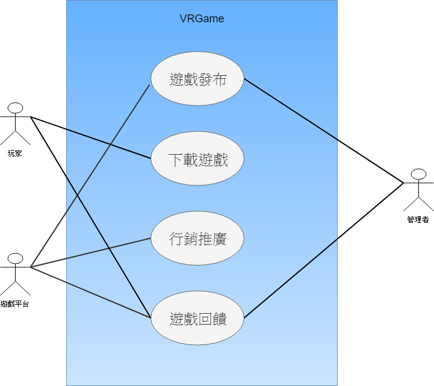
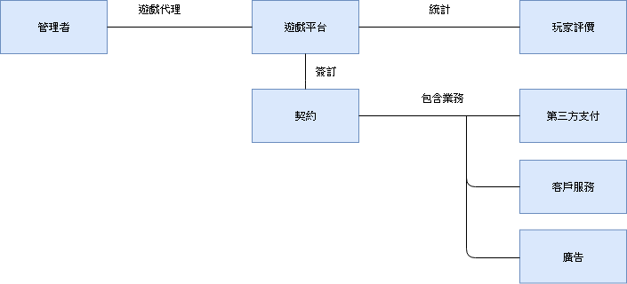
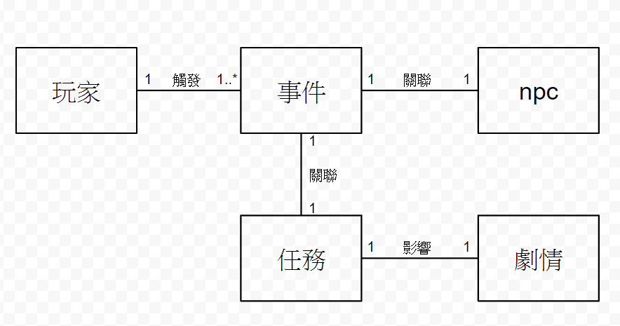
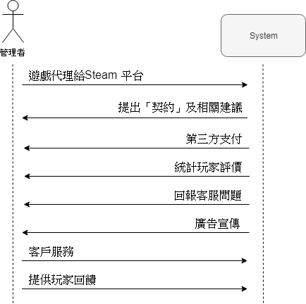
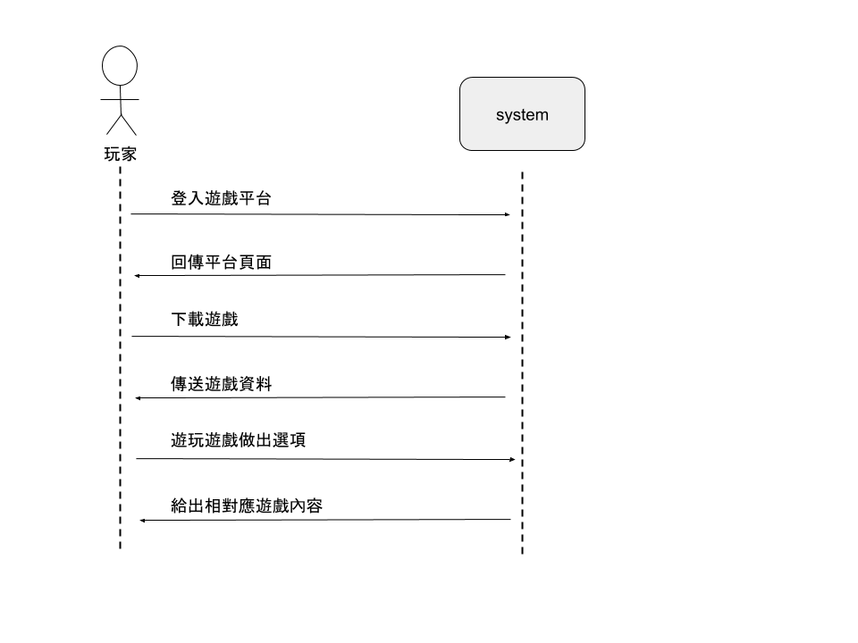

# 小組成員：
## 0624036　陳雋和
## 0624050　李鎮祐
## 0624068　吳學智
## 0424070　潘俊仁

# 1. 專題題目：
## VRGame-校園劇情對話

# 2. 文字敘述專題需求：
* ## 劇情要豐富趣味、有深度，可透過美術及音樂使玩家在視覺跟聽覺更能進入遊戲劇情。
* ## 遊戲流程要流暢，可加入懸疑元素，但是不能造成重大矛盾。
* ## 遊戲介面簡易，操作簡單且容易理解，各年齡層玩家都可遊玩。

# 3. 寫出專題之功能性需求與非功能性需求
 ## 功能性需求：
 * ### 可以發布至平台。
 * ### 玩家可以下載。
 * ### 遊戲銷售得出去。(發大財)
 * ### 玩家可以自由評論查詢資訊。
 
 ## 非功能性需求：
 * ### 輕量化：遊戲優化，效能更好，玩家可在20分鐘內將遊戲下載完。
 * ### 大眾化：玩家不需有昂貴設備亦可遊玩。
 * ### 美化　：提升遊戲質感，讓玩家留下好口碑。

# 4. 畫出 使用案例圖 (use case diagram)


# 5. 由上而下 排出 使用案例的重要性
 * ## 遊戲發布
 * ## 下載遊戲
 * ## 行銷推廣
 * ## 遊戲回饋
# 6. 寫出 其中的 至少三個使用案例
* ### 遊戲發布(管理者==Jim；遊戲代理商==Steam 平台；玩家==Andy)
```
　主要路徑
　　替代路徑
```
> #### 1. Jim 將遊戲代理給Steam 平台。
> #### 2. Steam 平台將遊戲上架。
> #### 3. Jim 每週四維護遊戲伺服器。
> #### 4. Andy 購買遊戲。
> #### 5. Andy 遊玩超過2小時，失去退貨權力。
>> #### 5.1. Andy 要求退貨退款。
> #### 6. Steam 平台向Jim 分配營利。
> #### 7. Steam 平台蒐集玩家意見。
* ###    下載遊戲
> #### 1. Andy 在Steam 平台看到本遊戲。
> #### 2. Steam 平台下載遊戲。
> #### 3. 遊戲中選擇不同劇情。
* ###    行銷推廣
> #### 1. Andy 遊玩之後，在Steam 平台上留下好評價。
> #### 2. Steam 平台將玩家評價蒐集，並統計。
> #### 3. Steam 平台將會推送遊戲給Andy 的朋友、相同興趣的玩家。
> #### 4. Jim 團隊製作遊戲短片、介紹，給Steam 平台。
> #### 5. Steam 平台上傳廣告。

# 7. 寫出 user story 
 * ## 身為{玩家}，我希望{遊戲可以下載}，藉此能{遊玩遊戲}。
 * ## 身為{玩家}，我希望{有遊戲回饋管道}，藉此能{評價遊戲}。
 * ## 身為{遊戲平台}，我希望{遊戲發布}，藉此能{獲得收益}。
 * ## 身為{遊戲平台}，我希望{遊戲可以銷售得好}，藉此能{獲得收益}。
 * ## 身為{遊戲平台}，我希望{獲得遊戲回饋}，藉此能{推廣給其他平台用戶}。
 * ## 身為{管理者}，我希望{獲得遊戲回饋}，藉此能{改善遊戲品質}。
 * ## 身為{管理者}，我希望{遊戲可以發布到平台}，藉此能{讓更多玩家下載}。
# 8. 初步類別圖(如下圖) 
## a.遊戲發布

## b.下載遊戲

## c.行銷推廣

# 9. 系統循序圖(如下圖)
## a.遊戲發布

## b.下載遊戲

## c.行銷推廣

# 10. 強韌圖

